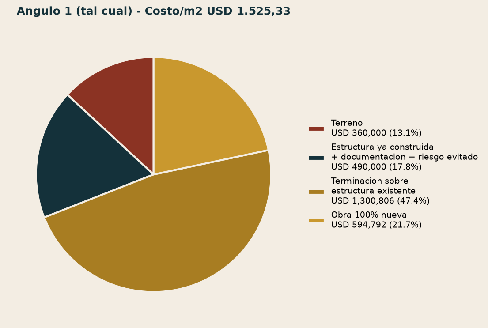
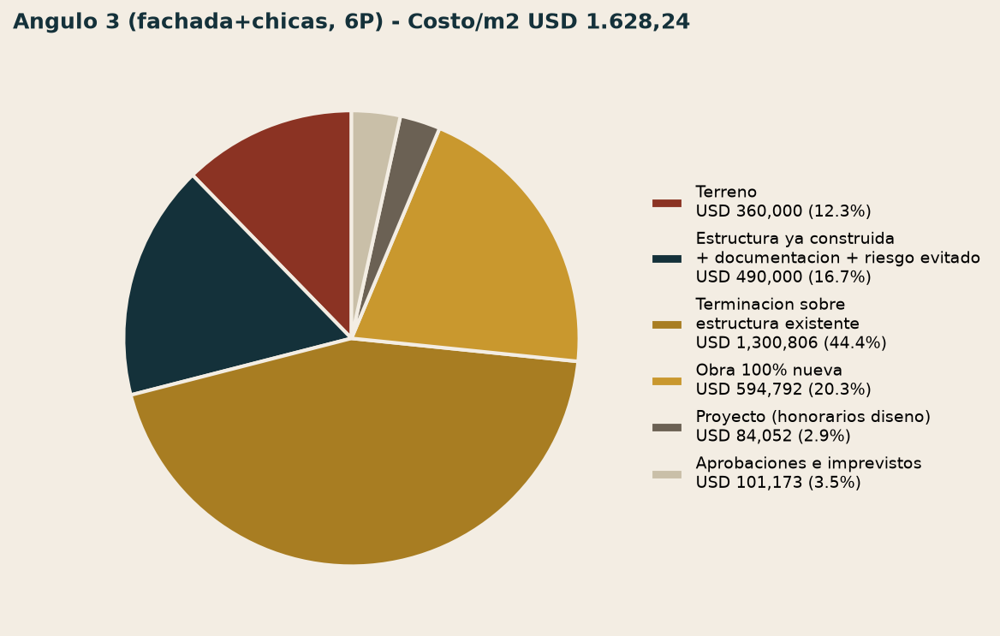
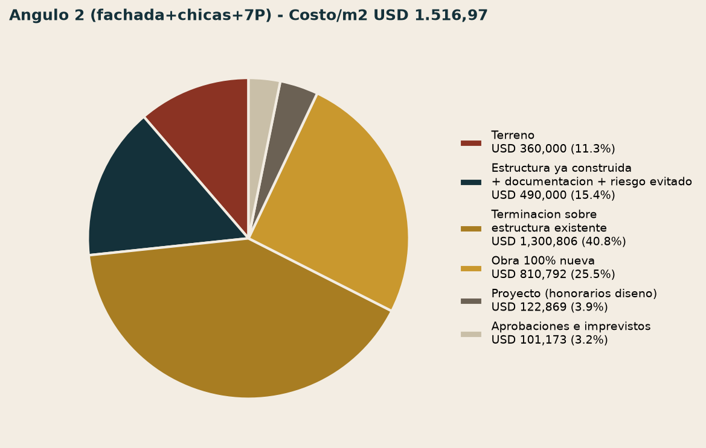
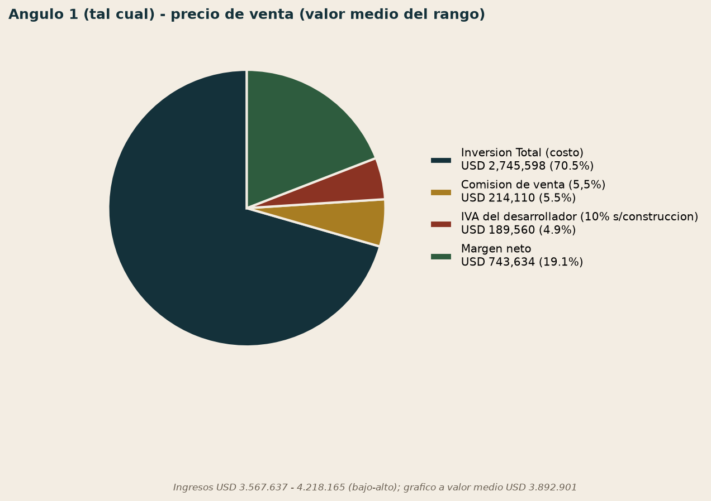
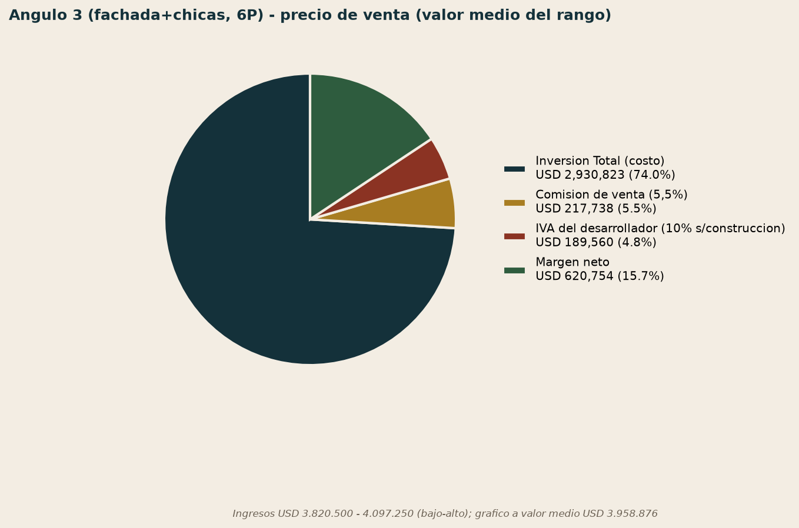
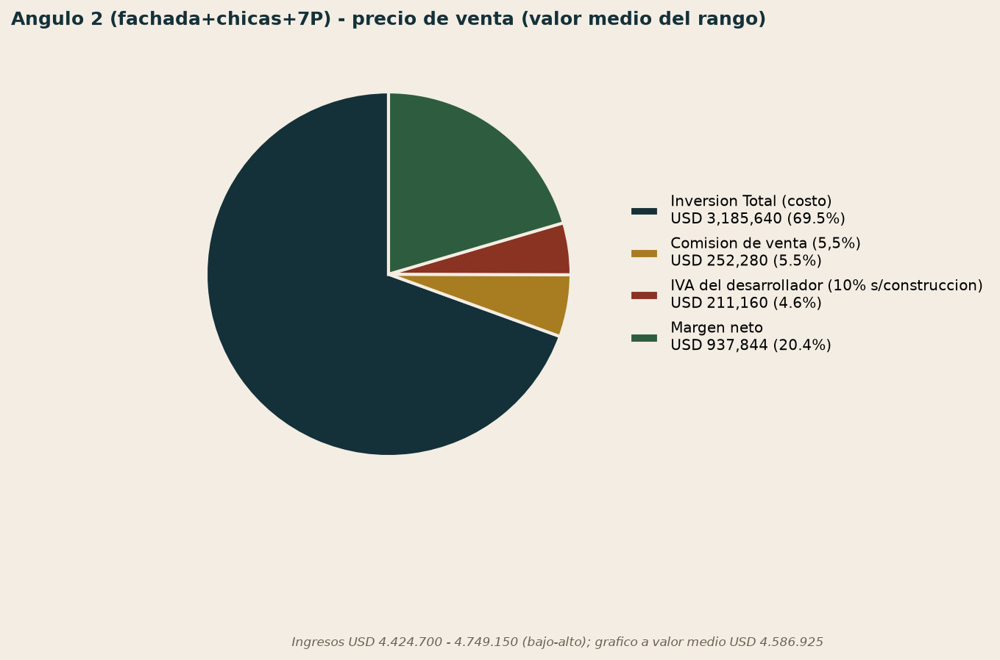

Estado: CURRENT — desagregación por ítem del costo/m² comercializable y del precio de venta, los tres Ángulos, con gráficos de torta reales
Fuente: `14-costo-de-entrada-definitivo-por-angulo.md`, `36-recosteo-720-e-iva-desarrollador-margen-final-definitivo.md`, `34-memorandum-de-inversion-y-recomendacion-final.md` — ningún número nuevo, solo desagregación y visualización de cifras ya confirmadas en el caso
Dominio: INVESTMENT (caso HERRERA-001)

# Desagregación por ítem — de USD 650/720 por m² a USD 1.525,33 / 1.628,24 / 1.516,97

## 0. Qué pidió el founder y qué responde este documento

*"Quiero que agreguemos un gráfico de torta con porcentajes de incidencia desagregando por ítem del costo del metro cuadrado comercializable (...) tanto del lado de la venta como del lado de los costos totales para el Ángulo 1-2 y 3. El objetivo es que se pueda entender cómo se llega desde los USD 650/720 por m² a los USD 1.525,33/1.628,24/1.516,97."*

La confusión que este documento resuelve: **USD 650/720 por m² es la tasa de construcción** (materiales + mano de obra) de `knowledge-base/investment/market-intelligence/construction-costs/06-costos-de-construccion.md` (D-064) — **no** es el costo de entrada total del proyecto. El costo de entrada real (USD 1.525,33–1.628,24/m² comercializable, según Ángulo) incluye, además de la construcción, la adquisición del terreno+estructura ya de pie, honorarios de proyecto, y aprobaciones. Ningún ítem de este documento es nuevo — todos ya estaban confirmados en `14-...md` y `36-...md`; lo que se agrega acá es la desagregación explícita por ítem y su visualización.

---

## 1. Lado de los costos — de USD 650/720/m² a los USD 1.525,33/1.628,24/1.516,97 finales

### 1.1 Los seis ítems

| Ítem | Qué es | Depende de |
|---|---|---|
| **Terreno** | Componente de terreno dentro del precio de compra (USD 850.000) | Fijo, `34-...md` §1 |
| **Estructura ya construida + documentación + riesgo evitado** | El resto del precio de compra — el 73,5% de estructura ya de pie, más los permisos/documentación ya obtenidos, más el tiempo/riesgo de obra que Meridiano se ahorra | Fijo, `34-...md` §1, validado ±10% en `10-...md` §3 |
| **Terminación sobre estructura existente** | 2.286,93 m² ya construidos × USD 720/m² × (1 − 21% de incidencia estructural, ya pagada) | Tasa de construcción (USD 720/m²) — **acá es donde entra el "$720"** |
| **Obra 100% nueva** | Los pisos/m² que no tienen ninguna estructura previa (826,10 m² en el envolvente de 6 pisos, 1.126,10 m² en el de 7) × USD 720/m² completo | Tasa de construcción (USD 720/m²) — **acá también entra el "$720"**, sin descuento |
| **Proyecto (honorarios de diseño)** | Honorarios de arquitectura/ingeniería del rediseño — solo aplica a Ángulo 2/3 (30%/40% de un costo de Proyecto de referencia, `14-...md` §2) | 0 en Ángulo 1 (ya incluido en el precio de compra) |
| **Aprobaciones e imprevistos** | Trámites municipales + contingencia — solo aplica a Ángulo 2/3 | 0 en Ángulo 1 |

**Los USD 650/m² (tasa Básica) no aparecen como una línea directa del costo de entrada** — se usan *dentro* del cálculo de "Estructura ya construida" (para valorar el esqueleto, `market-intelligence/construction-costs/06-...md` §"Metodología para separar...") y como referencia de validación (`10-...md` §3), pero el precio de compra de USD 850.000 ya es un número fijo y negociado, no una fórmula que recalcule con la tasa de USD 650/m² cada vez.

### 1.2 La tabla completa, los tres Ángulos (USD)

| Ítem | Ángulo 1 (tal cual) | Ángulo 3 (fachada+chicas, 6P) | Ángulo 2 (fachada+chicas+7P) |
|---|---|---|---|
| Terreno | 360.000,00 | 360.000,00 | 360.000,00 |
| Estructura ya construida + doc. + riesgo evitado | 490.000,00 | 490.000,00 | 490.000,00 |
| Terminación sobre estructura existente | 1.300.805,78 | 1.300.805,78 | 1.300.805,78 |
| Obra 100% nueva | 594.792,00 | 594.792,00 | 810.792,00 |
| Proyecto (honorarios diseño) | — | 84.051,81 | 122.869,08 |
| Aprobaciones e imprevistos | — | 101.173,48 | 101.173,48 |
| **Inversión Total** | **2.745.597,78** | **2.930.823,07** | **3.185.640,34** |
| Área comercializable | 1.800 m² | 1.800 m² | 2.100 m² |
| **Costo/m² comercializable** | **USD 1.525,33** | **USD 1.628,24** | **USD 1.516,97** |

**Verificado**: cada columna suma exactamente al total ya confirmado en `36-...md` §1.2 — no hay ningún número nuevo acá, solo el desglose que faltaba hacer explícito.

**Por qué Ángulo 2 tiene el costo/m² más bajo pese a construir más**: el piso adicional agrega USD 216.000 de obra nueva (810.792 vs. 594.792) y USD 38.817 más de Proyecto, pero también agrega 300 m² comercializables (2.100 vs. 1.800) — la superficie extra diluye mejor los costos fijos de Terreno+Estructura+Terminación (USD 2.191.605,78, el 69% del costo total, **idéntico en los tres Ángulos**).

### 1.3 Gráficos de torta — composición del costo/m² por Ángulo

**Lectura común a los tres**: los ítems fijos (Terreno + Estructura ya construida + Terminación) representan entre el 63% (Ángulo 2) y el 70% (Ángulo 1) del costo total — la mayor parte del costo de entrada no depende de qué Ángulo se elija, viene del precio de compra y de terminar lo que ya está de pie. La obra 100% nueva y los honorarios/aprobaciones (donde sí hay diferencias reales entre Ángulos) son la porción más chica.

---

## 2. Lado de la venta — de Ingresos a Margen, por ítem

### 2.1 Los cuatro ítems

| Ítem | Qué es | Varía con el precio de venta? |
|---|---|---|
| **Inversión Total (costo)** | La misma cifra de la sección 1 | No — fijo por Ángulo |
| **Comisión de venta** | 5,5% de los Ingresos (D-063) | Sí — sube con el precio |
| **IVA del desarrollador** | 10% sobre el costo de construcción (`36-...md` §2) | No — depende del costo, no del precio de venta |
| **Margen neto** | Lo que queda | Sí — residual |

### 2.2 La tabla completa, bajo/alto, los tres Ángulos (USD)

| | Ángulo 1 | Ángulo 3 | Ángulo 2 |
|---|---|---|---|
| Ingresos (bajo) | 3.567.637 | 3.820.500 | 4.424.700 |
| Ingresos (alto) | 4.218.165 | 4.097.250 | 4.749.150 |
| Inversión Total | 2.745.598 | 2.930.823 | 3.185.640 |
| Comisión (bajo–alto) | 196.220 – 231.999 | 210.128 – 225.349 | 243.358 – 261.203 |
| IVA del desarrollador | 189.560 | 189.560 | 211.160 |
| **Margen (bajo–alto)** | **436.259 – 1.051.008** | **489.990 – 751.518** | **784.541 – 1.091.147** |

**Verificado, ítem por ítem**: Inversión Total + Comisión + IVA + Margen = Ingresos, exacto, en los 6 casos (3 Ángulos × bajo/alto) — sin redondeos que no cuadren.

### 2.3 Gráficos de torta — composición del precio de venta, a valor medio del rango

**Por qué a valor medio y no bajo/alto por separado**: un gráfico de torta no representa bien un rango — se usa el punto medio de cada Ángulo para el gráfico (el subtítulo de cada imagen muestra el rango completo), y la tabla de la sección 2.2 queda como la fuente de verdad para bajo/alto exactos.

**Lectura**: el Ángulo 2 tiene el margen neto más alto en dólares (USD 937.844 a valor medio) pero **no** el mayor % de margen sobre ingresos (20,4%) — el Ángulo 1 tiene el % más alto (23,3% a valor medio) porque no carga honorarios de Proyecto ni Aprobaciones adicionales. La recomendación del Ángulo 2 en el Memorándum se sostiene en el margen absoluto y el ROI sobre la inversión total, no en el margen porcentual sobre ingresos — dos métricas distintas que no siempre apuntan al mismo Ángulo.

---

## 3. Qué se actualiza en el sistema con este documento

- `assets-analisis/` (nueva carpeta del caso): 6 imágenes de gráficos de torta, generadas con Python/matplotlib a partir de las cifras ya confirmadas de `14-...md`/`36-...md` — ningún dato inventado.
- `entregables/HERRERA-001_Investor_Book.pptx` — 2 slides nuevas con gráficos de torta nativos (editables en PowerPoint), una para costo y una para precio de venta, los 3 Ángulos.
